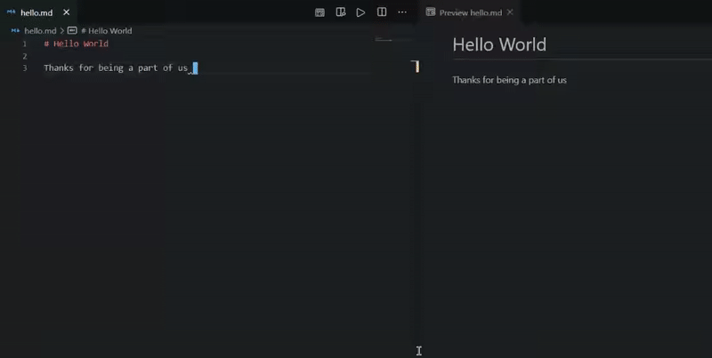
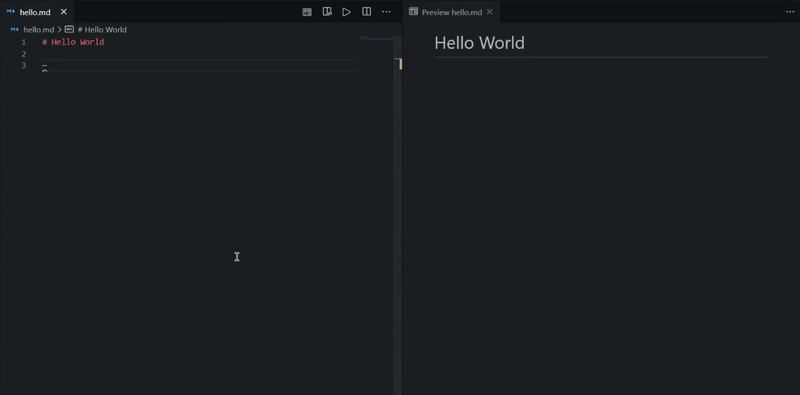
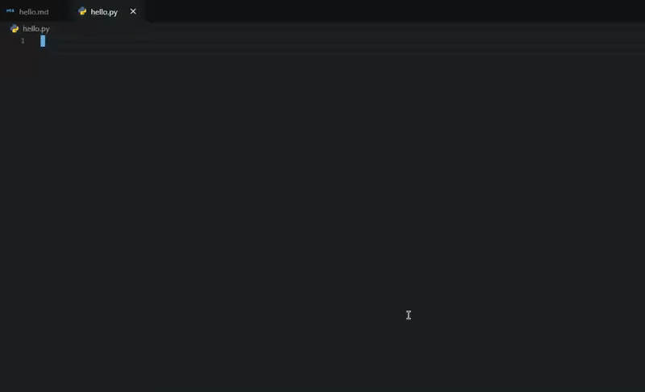

# Lightning Snippets

Simply add Python, C++ code snippets

Add Emojis, Markdown Styles, Shields.io icons

.

.

.

## Supported Languages

> Python, C++, Markdown

## How to

To add any function type `!` then the name. And `:` for emojis and markdown

e.g. `!sort_linear`, `:heart`

- Add Emoji

- Add Shields icon

- Add Snippet

## Features

- Easily add template functions
- Easily add function snippets having different `time complexity`

## Functions

### Python

- Sort (bubble, insertion)
- Search (linear, binary)

## Installation

Open VS Code and type `ctrl+P`, type `ext install tasnimzotder.lightning-snippets`.

## Release Notes -->

<!-- Users appreciate release notes as you update your extension. -->

### 1.0.2

- basic emojis
- markdown styles
- basic Shields.io icons

### 1.0.1

- Added python functions -> sort, search

### 1.0.0

- Added basic snippets

## LICENSE

This extension is licensed under the [MIT License](LICENSE)
