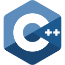

# Smart Snippets & Emojis

Simply add emojis to Markdown, HTML, JavaScript and smart snippets to Python, C++ codes

  
  
  
  

## Supported Languages

### 1. Emojis & Decorations

  
  

### 2. Smart Snippets (w/ emoji)

  
  
  
  

## How to

To add any function type `!` then the name. And `:` for emojis and markdown

e.g. `!sort_linear`, `:heart`

- Add Emoji

- Add Shields icon

- Add Snippet

## Features

- Easily add template functions
- Easily add function snippets having different `time complexity`

## Functions

### Python

- Sort (bubble, insertion)
- Search (linear, binary)

## Installation

Open VS Code and type `ctrl+P`, type `ext install tasnimzotder.lightning-snippets`.

## Release Notes -->

<!-- Users appreciate release notes as you update your extension. -->

## [1.0.4]

### Changed

- Rename extension - `Smart Snippets & Emojis` <- `Lightning Snippets`

### Added

- Snippets of JavaScript (& Node.js)

## [1.0.3]

### Added

- More emojis

## [1.0.2]

### Added

- Basic emojis
- Markdown styles
- Basic Shields.io icons

## LICENSE

This extension is licensed under the [MIT License](LICENSE)
